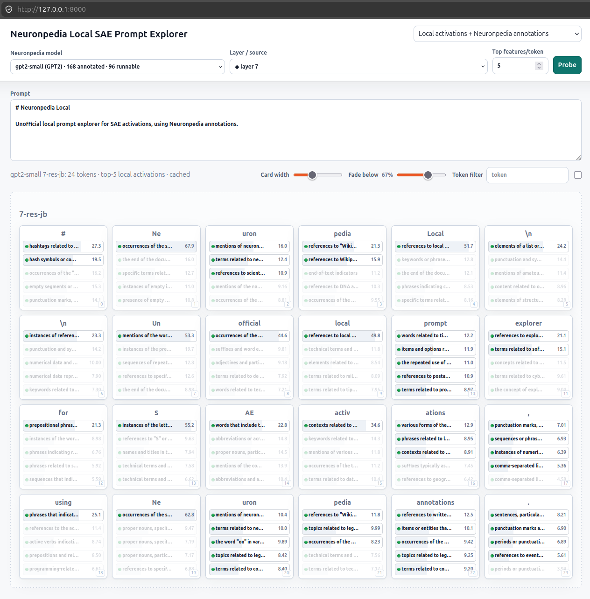

# Neuronpedia Local

Unofficial local prompt explorer for SAE activations, using Neuronpedia annotations.



## What It Does

- Browse Neuronpedia models and SAE sources.
- Probe a prompt token-by-token and inspect top activating SAE features.
- Run activations locally for supported GPT-2 small `res-jb` SAEs, while fetching only missing feature annotations from Neuronpedia.
- Or use Neuronpedia-hosted activations directly.
- Cache catalog, probe results, and individual feature annotations in local SQLite for 24 hours.

## Quick Start

```bash
uv sync
uv run uvicorn app:app --host 127.0.0.1 --port 8000
```

Open <http://127.0.0.1:8000>.

## Notes

- Default mode is local activations plus Neuronpedia annotations.
- Local activation currently supports `gpt2-small` `0-res-jb` through `12-res-jb`.
- First local run downloads GPT-2 and SAE weights through Hugging Face.
- `◆` in the layer/source dropdown marks sources supported by the local runner.
- Cache lives at `data/cache.sqlite` and is ignored by git.

## Reference

The official Neuronpedia repo is vendored as a git submodule under `vendor/neuronpedia`.
